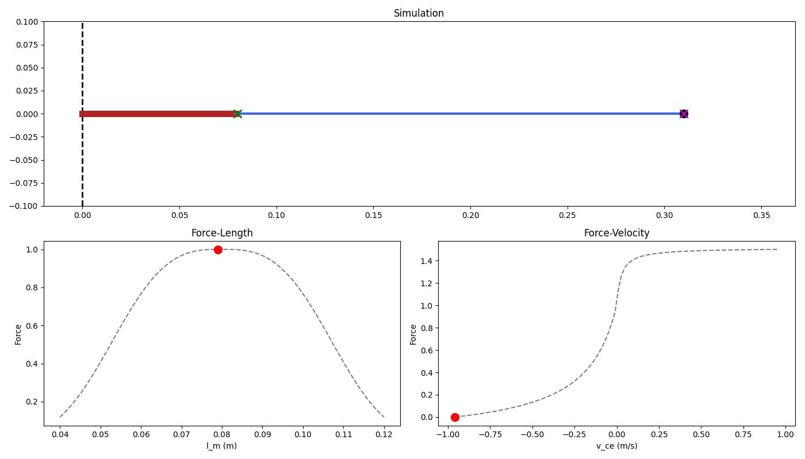

# Hill Type Muscle Model
A Python implementation of the Hill Type Muscle Model

## Animation 
The animation shows the muscle dynamics including the contractile element (CE) in red, series elastic element (SEE) in blue, and the Force-Length and Force-Velocity relationships over the 10-second simulation.

